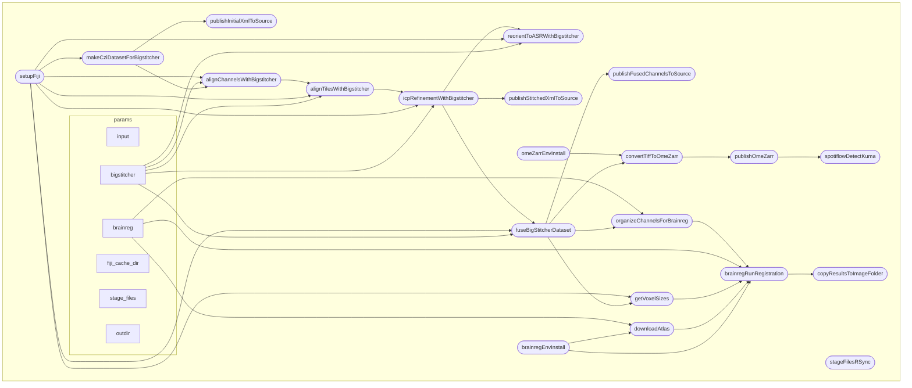

# Nextflow processing pipeline for mouse brain CZI files

This pipeline is taking one or several big Zeiss CZI image files of mouse brains, stitch them, fuse them, then register them using BrainGlobe atlases and registration tools.

It can work on a cluster / typically the SCITAS cluster @ EPFL, or locally with the local configuration.

The configurations for runnning the pipeline and for all of the processing parameters are located in `nextflow.config`



## Running the Pipeline

### Recommended Usage (with `--brain_id`)

The simplest way to run the pipeline uses `--brain_id` and `--user_name`:

```bash
# Single brain
nextflow run main.nf -resume -profile slurm --brain_id MS181 --user_name Lana_Smith -with-trace

# Multiple brains
nextflow run main.nf -resume -profile slurm --brain_id MS181,LS010 --user_name Lana_Smith -with-trace
```

This automatically constructs paths based on the data layout:
- **Input**: `<ssh_host>:<input_base_path>/<brain_id>/Anatomy/<brain_id>.czi`
- **Output**: `<ssh_host>:<output_base_path>/<user_name>/<brain_id>/`

The `ssh_host`, `input_base_path`, and `output_base_path` are configured in `nextflow.config` and rarely need overriding.

### Pipeline steps and skip flags

By default the pipeline runs **all** steps: stitch → fuse → publish results to NAS → OME-Zarr → spotiflow → registration → publish registration. Each step can be turned off with a `--skip_*` flag:

| Flag | Skips |
|---|---|
| `--skip_results_transfer` | publishing the XMLs + fused channel TIFFs to the NAS |
| `--skip_ome_zarr` | the ch1 → OME-Zarr conversion (and therefore spotiflow) |
| `--skip_spotiflow` | the spotiflow GPU spot detection on Kuma |
| `--skip_registration` | the brainreg registration (stops after fusion) |
| `--skip_registration_transfer` | copying the registration results to the NAS |

```bash
# Default: everything runs
nextflow run main.nf -resume -profile slurm --brain_id MS181 --user_name Lana_Smith -with-trace

# Stitch + fuse only — no NAS transfers, no zarr/spotiflow, no registration
nextflow run main.nf -resume -profile slurm --brain_id MS181 --user_name Lana_Smith \
  --skip_results_transfer --skip_ome_zarr --skip_registration -with-trace
```

### OME-Zarr Export

The fused ch1 channel is converted to a multi-resolution OME-Zarr pyramid by default (skip with `--skip_ome_zarr`). It is written to local cluster storage at `<ome_zarr_output_base>/<user_name>/<brain_id>/ch1.ome.zarr` (e.g. `/work/lsens/Lana_Smith/...`).

### Spotiflow Spot Detection (GPU, on the Kuma cluster)

The pipeline runs [Spotiflow](https://github.com/weigertlab/spotiflow) spot detection on the ch1 OME-Zarr. Spotiflow needs GPUs, and SCITAS **Jed has none**, so this step runs on the **Kuma** GPU cluster (`h100`): the Jed-side Nextflow process submits an `sbatch` job to Kuma over SSH and waits for it to finish. Input and output both live on the shared `/work` filesystem, so no data is copied between clusters.

It runs **by default after `publishOmeZarr`**. Skip it with `--skip_spotiflow` (or skip the whole OME-Zarr branch with `--skip_ome_zarr`):

```bash
# Default: spotiflow runs after the OME-Zarr is published
nextflow run main.nf -resume -profile slurm --brain_id MS181 --user_name Lana_Smith -with-trace

# Skip spotiflow for a run
nextflow run main.nf -resume -profile slurm --brain_id MS181 --user_name Lana_Smith --skip_spotiflow -with-trace
```

Predictions are written to `<ome_zarr_output_base>/<user_name>/detection_results/<spotiflow_version>/<brain_id>/`.

**Parameters** (in `nextflow.config`):

| Param | Default | Purpose |
|---|---|---|
| `kuma_host` | `<user>@kuma.hpc.epfl.ch` | SSH target for the GPU cluster |
| `spotiflow_version` | `spotiflow_lsfm_v6_scratch_preds` | Output subfolder (version label) |
| `spotiflow_model` | `spotiflow_scratch_annotated_clean_...` | Model directory name under `models_dir` |
| `spotiflow_sbatch` | `${projectDir}/bin/sbatch_spotiflow.batch` | The GPU batch script (2× h100, 180 GB) |

**One-time setup on Kuma** (the env and model live on shared `/work`, not in git):

1. **Passwordless SSH** from the Nextflow host (Jed) to `kuma_host` must be configured.
2. **Create the env** on a GPU-capable node:
   ```bash
   micromamba create -y -p <env_cache_dir>/spotiflow_12 -f bin/spotiflow_env.yml
   # e.g. /work/lsens/envs/spotiflow_12
   ```
3. **Place the model** under `<models_dir>/<spotiflow_model>` (e.g. `/work/lsens/models/spotiflow_scratch_annotated_clean_.../`).

### Dry Run (preview paths without processing)

```bash
nextflow run main.nf -profile slurm --brain_id BIOP_TEST --user_name Biop_User --dry_run
```

This prints all resolved input/output paths and exits immediately without running any processes.

### Check Voxel Sizes (inspect anisotropy before processing)

```bash
nextflow run main.nf -resume -profile slurm --brain_id BIOP_TEST --user_name Biop_User --check_voxels
```

This stages the CZI file and extracts the original voxel sizes using Bio-Formats. It displays:
- Original voxel sizes from the CZI file
- Post-ASR voxel sizes (if ASR reorientation is enabled), showing how axes are permuted
- Anisotropy ratio
- Expected fused voxel sizes based on the configured downsample factor

Useful for verifying anisotropy handling before running the full pipeline.

### Skip Registration (stop after fusion)

```bash
nextflow run main.nf -resume -profile slurm --brain_id BIOP_TEST --user_name Biop_User --skip_registration
```

Runs the pipeline through stitching and fusion but skips brainreg registration. Useful for inspecting fused output (voxel sizes, orientation) before committing to the registration step. (Combine with `--skip_ome_zarr` to also skip the OME-Zarr/spotiflow branch.)

### Local Execution

```bash
nextflow run main.nf -resume -profile local --input /path/to/file.czi -with-trace
```

### Multiple Files (explicit paths)

```bash
nextflow run main.nf -resume -profile local --input /path/to/file1.czi,/path/to/file2.czi -with-trace
```

### SLURM Cluster Execution

```bash
# Start a screen session (required for long-running transfers)
screen -S register_brains_0

# Load Java module
module load openjdk/21.0.0_35-h27dssk

# Run pipeline on SLURM (recommended: use --brain_id)
nextflow run main.nf -resume -profile slurm --brain_id MS181 --user_name Lana_Smith -with-trace

# Or with explicit SSH path (--user_name still needed for output publishing)
nextflow run main.nf -resume -profile slurm \
  --input user@host:/remote/path/file.czi --user_name Lana_Smith -with-trace
```

### Screen Session Management

```bash
screen -S session_name    # Start new session
screen -ls                # List sessions
screen -r session_name    # Reattach to session
# Ctrl+a d                # Detach from session
```

## How to set up this workflow on a SLURM cluster

Make sure nextflow is installed. The installation instructions are provided [here](https://www.nextflow.io/docs/latest/install.html#self-install).

You will need to have a Java module installed, for instance on EPFL's scitas cluster, this is done with `module load openjdk/21.0.0_35-h27dssk`.

Then clone the repository `git clone https://github.com/NicoKiaru/mouse_czi_processing` (current URL).

You should now be able to run the workflow in command line

## Development

To work on this project, you can:
* install vscode and its nextflow extension
* install nextflow (on wsl if you are on windows)
* install apptainer
* download a sample dataset (https://zenodo.org/records/8305531/files/Demo%20LISH%204x8%2015pct%20647.czi?download=1)
* run a test example command line


## History

This pipeline is the third iteration of a similar pipeline. The idea is to combine the functionalities of https://github.com/BIOP/lightsheet-brain-workflows with the cluster capabilities of  https://github.com/LanaSmith1313/cluster_analysis 

```
nextflow run main.nf -resume -profile slurm --brain_id BIOP_TEST --user_name Biop_User --dry_run
```